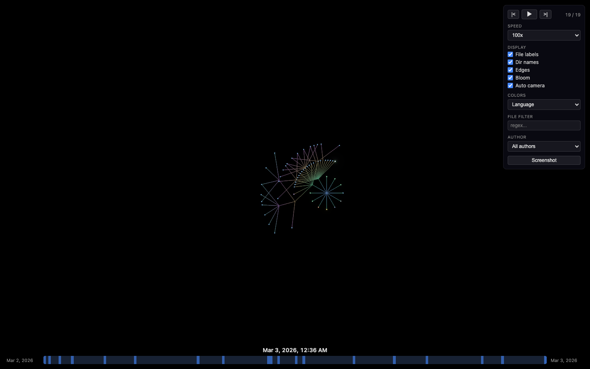
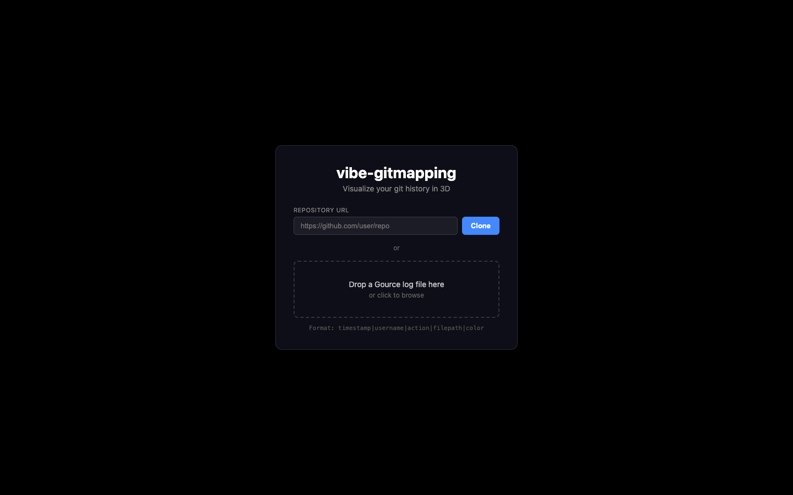

# vibe-gitmapping

A web-based git history visualization tool inspired by [Gource](https://gource.io/). Watch your repository come alive as files appear, grow, and change over time in an interactive radial tree rendered with Three.js.



## Quick Start

```bash
# Install dependencies
npm install

# Start the development server
npm run dev
```

Open [http://localhost:5173](http://localhost:5173) in your browser.



## Loading Your Repository

### Option 1 — Gource Custom Log File

Generate a Gource-compatible log from any git repository:

```bash
git log --pretty=format:'%at|%an' --name-status --reverse | awk '
BEGIN { FS="\t"; OFS="|" }
/^[0-9]+\|/ { split($0, a, "|"); ts=a[1]; user=a[2]; next }
/^A\t/ { print ts, user, "A", $2 }
/^M\t/ { print ts, user, "M", $2 }
/^D\t/ { print ts, user, "D", $2 }
/^R[0-9]*\t/ { print ts, user, "D", $2; print ts, user, "A", $3 }
' > my-repo.log
```

Then either **drag and drop** the `.log` file onto the app, or click **browse** to select it.

The expected format is one entry per line:

```
timestamp|username|action|filepath
```

- `timestamp` — Unix epoch seconds
- `username` — Author name
- `action` — `A` (add), `M` (modify), or `D` (delete)
- `filepath` — Path relative to repo root

### Option 2 — Gource's Native Format

If you already use Gource, its `--output-custom-log` flag produces a compatible file directly:

```bash
gource --output-custom-log my-repo.log /path/to/repo
```

## Controls

### Playback

| Key | Action |
|-----|--------|
| `Space` | Play / Pause |
| `N` | Next commit |
| `Shift+N` or `P` | Previous commit |
| `Left` / `Right` | Cycle speed presets |
| `1`–`9` | Set speed directly (1x, 2x, 5x, 10x, 20x, 25x, 50x, 67x, 100x) |

### Camera & Display

| Key | Action |
|-----|--------|
| `V` | Toggle camera mode (free / auto-tracking) |
| `F` | Toggle fullscreen |
| `Esc` | Deselect file |
| Scroll | Zoom in / out |
| Click + Drag | Pan the view |

### Settings Panel (top-right)

- **Speed** — Dropdown to pick a playback speed multiplier
- **File labels** — Toggle filename display on hover
- **Dir names** — Toggle directory name labels
- **Edges** — Toggle directory tree connections
- **Bloom** — Toggle glow post-processing effect
- **Auto camera** — Toggle automatic camera tracking of active commits
- **Colors** — Switch between `Language`, `Author`, or `Age` color schemes
- **File filter** — Regex to include/exclude files (e.g. `\.test\.ts$`)
- **Author** — Filter commits by a specific contributor
- **Screenshot** — Save the current view as a PNG

### Interacting with Nodes

- **Hover** over a file dot to see its name
- **Hover** over a contributor avatar to see their name
- **Click** a file dot to open the info panel with full details: path, extension, last author, modification history, and alive/deleted status

## How It Works

1. **Parser** — A Web Worker parses the Gource log off the main thread, grouping entries into commits sorted by timestamp.
2. **Tree** — An incremental `FileTree` data structure tracks all files and directories as they are added, modified, or deleted.
3. **Layout** — A radial BFS layout engine positions nodes on the XZ plane, with the repo root at the center and directories branching outward.
4. **Renderer** — Three.js renders the scene using:
   - `InstancedMesh` with `CircleGeometry` for file nodes (up to 100k)
   - `LineSegments` for directory edges
   - Billboard sprites for contributor avatars
   - Bloom post-processing for glow effects
5. **Animation Engine** — A `useFrame` loop advances through commits at the configured speed, applying file changes to the tree, updating the layout, and driving pulse/fade/travel animations.

## Development

```bash
# Run the test suite (370 tests)
npm test

# Run tests in watch mode
npm run test:watch

# Lint
npm run lint

# Format
npm run format

# Production build
npm run build
```

## Tech Stack

- **React 19** + **TypeScript**
- **Three.js** via [@react-three/fiber](https://docs.pmnd.rs/react-three-fiber) + [@react-three/drei](https://github.com/pmndrs/drei)
- **Zustand** for state management
- **Vite** for bundling and dev server
- **Vitest** for testing

## License

MIT
